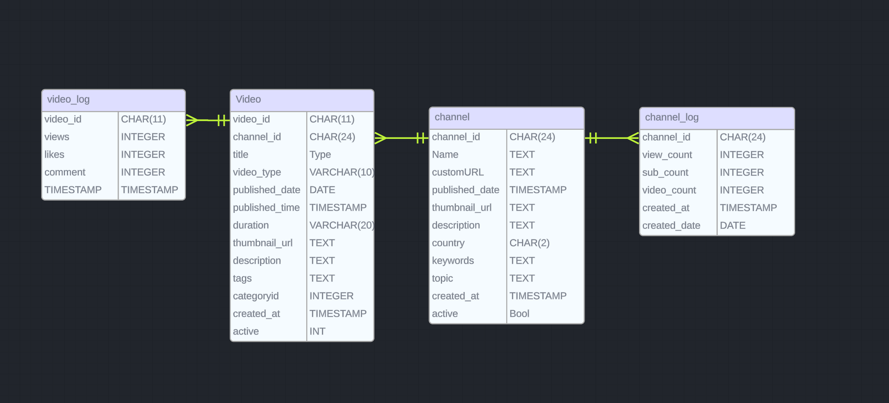

# Youtube Insights

[](https://codecov.io/gh/harryhowiefish/youtube-insight)

<!-- ## Introduction -->
Want to gain insight on youtube channels? This is the tool for you! 

This repo include all the tools for any youtube analytical needs. From web scraper using custom crawler and youtube API to gather information on specified channels, RDB designed to store them, to ETL pipeline that transform the raw data to analytical tables that provides insights. Ideal for companies looking for sponsorship opportunities and people who are interested in the landscape.

The current setup in this repo contain 4 DAGs. Two for insert and update the OLTP database. The third being a monthly ETL pipeline. And the last DAG for DB control (optional use for AWS RDS).

### ER diagram for OLTP


### Fact and dimension table for data warehouse


### Visualization examples


## Tools used

- Python packages
    - crawler: requests
    - database related: psycopg2, boto3
    - data processing: pyspark
    - data visualization: plotly

- Database: Postgres, (parquet and csv for pipeline checkpoints)
- Orchestration/container: Docker, Airflow

## Usage

### Setup

Follow .env.sample to create your .ENV file.
Please follow instructions [here](https://developers.google.com/youtube/v3/getting-started) to set up Youtube API key.

### Run Postgres docker
```
docker build -t youtube_db .
docker run --name youtube_db -v mydbdata:/var/lib/postgresql/data -p 5432:5432 -d my_youtube_db
```

### Select channels to track

option 1: search with channel keyword
```
python3 src/add_channels/search_channel_id.py <keyword>

>> Is this channel <keyword> correct? 
>> 1 for Yes, 2 for No: 1

>> The channel id is: <channel id>
>> Do you want to add data to db?
>> 1 for Yes, 2 for No: 1
```

option 2: add with channel ids (txt file)
```
# channel_id.txt
UCvw1LiGdyulhnGksJlGWB6g,UCGbshtvS9t-8CW11W7TooQg
```
```
python3 src/add_channels/add_channel_listing.py channel_id.txt
```

### Run Airflow server (connecting to AWS RDS for postgres Database)
The following are some important config files to include
AWS credential is in ~/.aws and .ENV file exist.
```
docker compose up airflow-init
docker compose up -d
```

### Visualize result
use the notebooks in the visualization folder to explore insights into your selected channels.

## Working progress
- Modify ETL so less data is loaded everytime
- Rename OLAP columns, save to database (maybe mongo?)
- interactive plotly
- dashboard with dash
- add hive, mongodb integration
- directly connect postgres to airflow.
- add file cleanup code for airflow + other airflow optimization
- add dataclass for data validation during data crawling
- add Slowly Changing Dimensions (SCD) to video info

## Issues
2. add status to missing video can't find
3. DB stores commas which causes issue during csv progessing

## Resources
[youtube data API documentation](https://developers.google.com/youtube/v3/docs)
[pytube: for downloading video and other info from youtube](https://github.com/pytube/pytube)